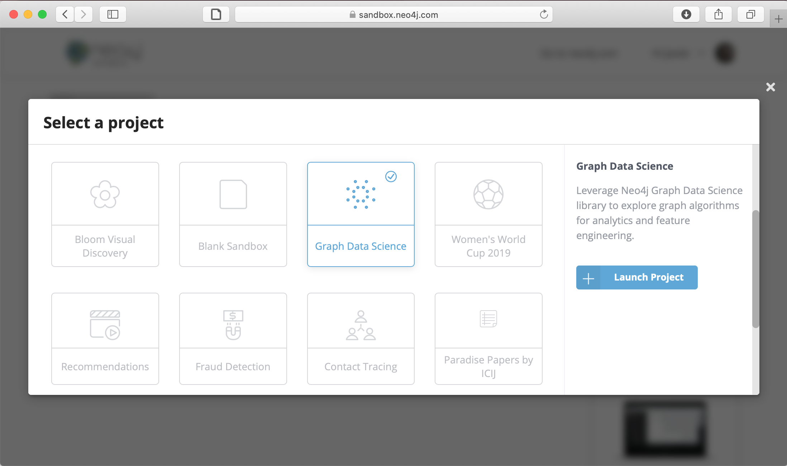
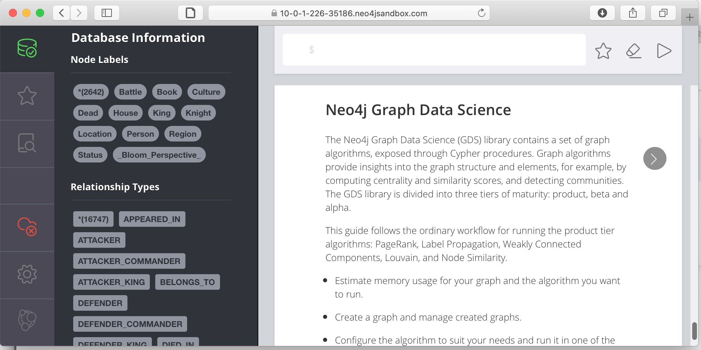
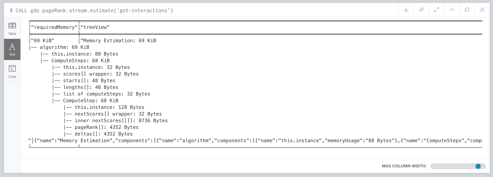
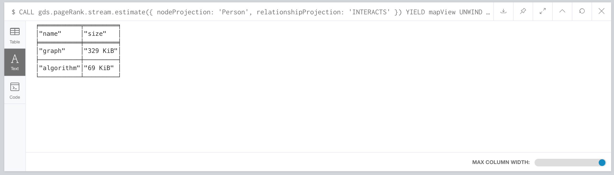
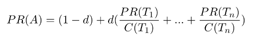
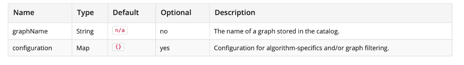
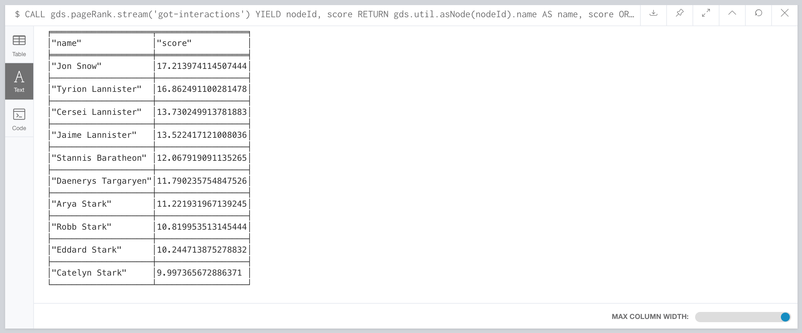
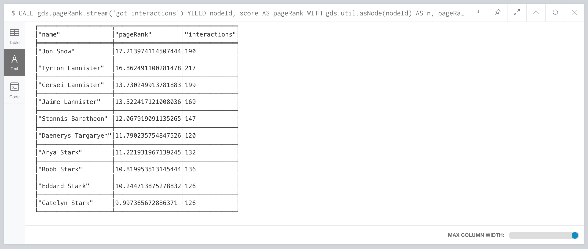

# Tutorial: Data Science on Graphs with Neo4J

**Genoveva Vargas-Solar**   
_CNRS, LIG-LAFMIA, Grenoble_   
[genoveva.vargas@imag.fr](mailto:genoveva.vargas@imag.fr)


## Requirements
- [Neo4J sandbox](https://neo4j.com/sandbox/)
- Game of Thrones dataset (included in the Neo4J sandbox)


## Attribution

Tutorial  partly based in the _Neo4j Graph Data Science tutorial_. 


## Creating a data science project

1. Access your Neo4J sandbox and choose to create a **Graph Data Science project**

	

1. Select **Open with Browser**

1. Click on the database icon to get Information about the Game of Thrones dataset

	


The graph contains `:Person` nodes, representing the characters, and `:INTERACTS` relationships, representing the characters' interactions.

An interaction occurs each time two characters' names (or nicknames) **appear within 15 words of one another** in the book text.

> For more information about the data extraction process, see [Network of Thrones, A Song of Math and Westeros](https://networkofthrones.wordpress.com/from-book-to-network/), research by Dr. Andrew Beveridge.

The `(:Person)-[:INTERACTS]→(:Person)` graph is enriched with data on houses, battles, commanders, kings, knights, regions, locations, and deaths.


## 1. First steps on data science

The general workflow of a data science project starts with a quantitative and structural exploration of datasets. The objective is to understand the content and have an idea on the computing and memory resources required to process the dataset.

### 1.1 Exploring the dataset

Run the following query to visualize the schema of your graph:

```cypher
CALL db.schema.visualization()
```

The  `:Dead`,  `:King`, and  `:Knight`  labels all appear on  `:Person`  nodes. You may find it useful to remove them from the visualization to make it easier to inspect.

### 1.2. Quantitative profile

The data science add-on of Neo4J does not provide a transparent management of main memory, so it is important to have a quantitative profile of the graph to process and use Neo4J tools to estimate the memory requirements and configure the system (e.g, tunning the heap size).

#### 1.2.1 Statistics

Compute statistics to determine data distribution. For example, minimum, maximum, average and standard deviation of the number of interactions per character in the graph.

```cypher
MATCH (c:Person)-[:INTERACTS]->()
WITH c, count(*) AS num
RETURN min(num) AS min, max(num) AS max, avg(num) AS avg_interactions, stdev(num) AS stdev

```

Calculate the same grouped by book:

```cypher
MATCH (c:Person)-[r:INTERACTS]->()
WITH r.book as book, c, count(*) AS num
RETURN book, min(num) AS min, max(num) AS max, avg(num) AS avg_interactions, stdev(num) AS stdev
ORDER BY book
```

#### 1.2.2 Allocating memory resources for processing graphs

Now it is necessary to estimate the memory required by the graph and the algorithms for processing it, for configuring Neo4J server with a larger heap than the one allocated for the transactional processing.

The graph algorithms of the data science add-on run on an in-memory heap allocated projection of the Neo4J graph. This means that before executing any algorithm you need to create implicitly or explicitly projections of a persistent graph in-memory. Processing graphs like this can have a significant memory footprint.

Therefore, it is necessary to estimate the amount of RAM required for a graph to be processed in order to configure the heap size before running a heavy memory workload.


#### Estimating memory usage for graphs

To estimate the required memory for a subset of your graph, for example, the  `Person`  nodes and  `INTERACTS`  relationships run the following:

```cypher
CALL gds.graph.create.estimate('Person', 'INTERACTS')
YIELD nodeCount, relationshipCount, requiredMemory
```


The result shows that the example graph is small. So you can create a projected graph and name it `got-interactions`.

```cypher
CALL gds.graph.create('got-interactions', 'Person', 'INTERACTS')
```

To estimate the memory needed to execute an algorithm on your  `got-interactions`  graph, for example, Page Rank, call the following procedure. The estimation only considers the algorithm execution, and the graph is already in-memory.

```cypher
CALL gds.pageRank.stream.estimate('got-interactions')
YIELD requiredMemory
```


#### Estimating memory usage details

For looking at the full details of memory estimation, remove the `YIELD`  clause. The procedure returns a tree view and a map view of all the "components" with their memory estimates. Note that the more detailed views contain estimates on the individual compute steps and the result data structures.

```cypher
CALL gds.pageRank.stream.estimate('got-interactions')
```



>  Details about memory usage can be found here: [https://neo4j.com/docs/graph-algorithms/current/projected-graph-model/memory-requirements/](https://neo4j.com/docs/graph-algorithms/current/projected-graph-model/memory-requirements/)

You can also estimate the memory usage for graph creation and algorithm execution at the same time by using the so-called _implicit graph creation_. This way, the configuration for the graph creation is in-lined within the algorithm procedure call. The result shows an increased memory estimate, explained by the memory consumed by graph creation.

```cypher
CALL gds.pageRank.stream.estimate({nodeProjection: 'Person', relationshipProjection: 'INTERACTS'})
```

Now, you can filter the result to the top level components: graph and algorithm.

```cypher
CALL gds.pageRank.stream.estimate({
    nodeProjection: 'Person',
    relationshipProjection: 'INTERACTS'
}) YIELD mapView
UNWIND [ x IN mapView.components | [x.name, x.memoryUsage] ] AS component
RETURN component[0] AS name, component[1] AS size
```




#### Memory clean up

If you do not want to use the projected graph anymore, a good practice is to release it from the memory.

```cypher
CALL gds.graph.drop('got-interactions');
```

## 1.3 Creating and preparing graphs for analytics

To enable fast caching of the graph topology containing only the relevant nodes, relationships and weights, it must reside as an in-memory projection of the stored graph. Projections change the nature of graph elements by:

- Sub-graphing
- Renaming relationship types and node labels
- Merging several relationship types and node labels
- Altering relationship direction
- Aggregating parallel relationships and their properties
- Deriving relationships from larger patterns

There are two ways of creating graph projections:  _explicit_  and  _implicit_.

The workflow is to create a graph projection explicitly by naming it and storing it in the graph catalogue.

It is possible to create a graph about the Game of Thrones dataset considering that the `INTERACTS` relationships are symmetric. For instance, by creating a graph projection with `UNDIRECTED` orientation.

```cypher
CALL gds.graph.create('got-interactions', 'Person', {
    INTERACTS: {
        orientation: 'UNDIRECTED'
    }
})
```

#### Cypher projection


Two queries must be run: one for the nodes and one for the relationships.

It is possible to remove parallel relationships between the pair of nodes adding an `aggregation`  key for the property `weight`, in the `reationshipProperties`  specification. The `relationshipProperties`  configuration maps a returned property to property names used internally.


```cypher
CALL gds.graph.create.cypher(
    'got-interactions-cypher',
    'MATCH (n:Person) RETURN id(n) AS id',
    'MATCH (s:Person)-[i:INTERACTS]->(t:Person) RETURN id(s) AS source, id(t) AS target, i.weight AS weight',
    {
        relationshipProperties: {
        weight: {
            property: 'weight',
            aggregation: 'SINGLE'
        }
    }
})
```

The first query returns the node ID’s. The second one returns de source and target IDs of the relationships. The `aggregation`  key modifies the property values according to the specified aggregation. Here we see any pair of Cypher queries as they return the expected columns and field types.

To keep all relationships, use `aggregation: 'NONE'`.

To retain one of the relationships (arbitrary selected), use `aggregation: 'SKIP'`.

#### Cypher projection of virtual relationships

Cypher graph projections allow to represent complex patterns by computing relationships that do not exist in the Neo4J stored graph. This is useful when the data science algorithm supports only mono-partite graphs.

For example, you can use the following query to create a graph with `Person`  nodes connected with (untyped) relationship if they belong to the same house. The projected relationship does not exist in the stored graph:

```cypher
CALL gds.graph.create.cypher(
    'same-house-graph',
    'MATCH (n:Person) RETURN id(n) AS id',
    'MATCH (p1:Person)-[:BELONGS_TO]-(:House)-[:BELONGS_TO]-(p2:Person) RETURN id(p1) AS source, id(p2) AS target'
)
```

#### Standard loading and Cypher projection

Two approaches are supported for loading projected graphs:
* Standard creation ( `gds.graph.create()`  )
* Cypher projection ( `gds.graph.create.cypher()` ).

**Standard creation**: specify node labels and relationship types and then project them onto the in-memory graph as labels and relationship types with new names. It is possible to specify properties for each node label and relationship type. It is not possible to take only some nodes with a given labels or some relationships with a given type. A way to work around is by adding additional labels that define the desired subset of nodes to project.

**Cypher projection**: Use Cypher queries to project nodes and relationships onto the in-memory graph by defining node-statements and relationship statements. The expressivity of Cypher is leveraged to specify the graph to analyse in a more sophisticated manner.

Note that the standard creation is orders of magnitude faster than the Cypher projection.

In the Game of Thrones example, we can project and load the graph with a new name, for example `got-interactions-cypher`.


### 1.3.2 Querying the Graph catalogue

Managing a projected graph with three main functions: listing, existence and remove.

##### Listing

```cypher
CALL gds.graph.list('got-interactions-cypher')
```

You can list the graphs you have loaded so far.

```cypher
CALL gds.graph.list()
```
#### Existence

Check if a graph exists in the catalogue.

```cypher
CALL gds.graph.exists('got-interactions')
```


#### Remove

Free memory space by dropping graphs from the catalogue. It is good practice to remove the unused graphs from memory. Multiple users running algorithms at the same time is not supported.

```cypher
CALL gds.graph.drop('got-interactions-cypher');
```


## 1.4 Getting started with algorithms

Algorithms in Neo4J can run on explicitly and implicitly created graphs. For this tutorial we will see some of the most prominent algorithms:

- Page Rank
- Label propagation
- Weakly Connected Components
- [Louvain](1.7-Louvain.html)
- Node similarity
- [Shortest path](1.8-Shortest-path.md)

Running algorithms on explicitly created graphs allows to operate on a graph multiple time. To do this refer to the graph by its name, since it is stored in the graph catalogue as seen in the previous section.  **The syntax for applying algorithms**  on  **explicit graphs**  is the following:

```cypher
CALL gds.<algo-name>.<mode>(
    graphName: String,
    configuration: Map
)
```

-   `<algo-name>`  is the algorithm name.
-   `<mode>`  is the algorithm execution mode. The supported modes are:
    -   `write`: writes results to the Neo4j database and returns a summary of the results.
    -   `stats`: same as  `write`  but does not write to the Neo4j database.
    -   `stream`: streams results back to the user.
-   The  `graphName`  parameter value is the name of the graph from the graph catalog.
-   The  `configuration`  parameter value is the algorithm-specific configuration.

**The syntax for applying algorithms** on  **implicit graphs**  is the following. Note that it does not access the catalogue. So, the graph creation must be configured within the algorithm configuration map. Once the algorithm has been executed the graph is released from the memory.

```cypher
CALL gds.<algo-name>.<mode>(
    configuration: Map
)
```


## 1.5 Page Ranking

Belongs to centrality operations, the objective is to **identify influential nodes based on their position in the network**.

The PageRank algorithm measures the importance of each node within the graph, based on the number incoming relationships and the importance of the corresponding source nodes. The underlying assumption, roughly speaking, is that a page is only as important as the pages that link to it. PageRank is introduced in the original Google paper as a function that solves the following equation :




where,

-   we assume that a page _A_ has pages _T<sub>1</sub>_ to _T<sub>n</sub>_ which point to it.
-   _d_ is a damping factor which can be set between 0 and 1. It is usually set to 0.85.
-   _C(A)_ is defined as the number of links going out of page _A_.

This equation is used to iteratively update a candidate solution and arrive at an approximate solution to the same equation.

> The original Google paper is [here](http://infolab.stanford.edu/~backrub/google.html). 
>
> An efficient partition based parallel version is [here](http://delab.csd.auth.gr/~dimitris/courses/ir_spring06/page_rank_computing/01531136.pdf). 
>
> For use cases see [here](https://arxiv.org/pdf/1407.5107.pdf).


### 1.5.1 Preparing a graph

The general expression to use the page rank function looks as follows:

```cypher
CALL gds.pageRank.stream(
    graphName: String,
    configuration: Map
) 
YIELD
    nodeId: Integer,
    score: Float
```




The results are not persistent.

To test it we can create a new graph example. This graph represents eight pages, linking to one another. Each relationship has a property called weight, which describes the importance of the relationship.

```cypher
CREATE
(home:Page  {name:'Home'}),
(about:Page  {name:'About'}),
(product:Page  {name:'Product'}),
(links:Page  {name:'Links'}),
(a:Page  {name:'Site A'}),
(b:Page  {name:'Site B'}),
(c:Page  {name:'Site C'}),
(d:Page  {name:'Site D'}),
(home)-[:LINKS  {weight:  0.2}]->(about),
(home)-[:LINKS  {weight:  0.2}]->(links),
(home)-[:LINKS  {weight:  0.6}]->(product),
(about)-[:LINKS  {weight:  1.0}]->(home),
(product)-[:LINKS  {weight:  1.0}]->(home),
(a)-[:LINKS  {weight:  1.0}]->(home),
(b)-[:LINKS  {weight:  1.0}]->(home),
(c)-[:LINKS  {weight:  1.0}]->(home),
(d)-[:LINKS  {weight:  1.0}]->(home),
(links)-[:LINKS  {weight:  0.8}]->(home),
(links)-[:LINKS  {weight:  0.05}]->(a),
(links)-[:LINKS  {weight:  0.05}]->(b),
(links)-[:LINKS  {weight:  0.05}]->(c),
(links)-[:LINKS  {weight:  0.05}]->(d);
```

The following statement will create a graph using a native projection and store it in the graph catalog under the name `myGraph`.

```cypher
CALL gds.graph.create(
    'myGraph',
    'Page',
    'LINKS',
    {
        relationshipProperties: 'weight'
    }
)
```

#### Memory Estimation

First off, we will estimate the cost of running the algorithm using the  `estimate`  procedure. This can be done with any execution mode. We will use the  `write`  mode in this example. Estimating the algorithm is useful to understand the memory impact that running the algorithm on your graph will have. When you later actually run the algorithm in one of the execution modes the system will perform an estimation. If the estimation shows that there is a very high probability of the execution going over its memory limitations, the execution is prohibited.

The following will estimate the memory requirements for running the algorithm:

```cypher
CALL gds.pageRank.write.estimate('myGraph', {
    writeProperty: 'pageRank',
    maxIterations: 20,
    dampingFactor: 0.85
})
YIELD nodeCount, relationshipCount, bytesMin, bytesMax, requiredMemory
```

### 1.5.2 Stream mode

In the  `stream`  execution mode, the algorithm returns the score for each node. This allows us to inspect the results directly or post-process them in Cypher without any side effects. For example, we can order the results to find the nodes with the highest PageRank score. The above query is running the algorithm in stream mode as `unweighted`.

```cypher
CALL gds.pageRank.stream('myGraph')
YIELD nodeId, score
RETURN gds.util.asNode(nodeId).name AS name, score
ORDER BY score DESC, name ASC
```

### 1.5.3 Mutate

The  `mutate`  updates the named graph with a new node property containing the score for that node. The name of the new property is specified using the mandatory configuration parameter `mutateProperty`. The result is a single summary row. The  `mutate`  mode is especially useful when multiple algorithms are used in conjunction. The following will run the algorithm in mutate  mode.

```cypher
CALL gds.pageRank.mutate('myGraph', {
    maxIterations: 20,
    dampingFactor: 0.85,
    mutateProperty: 'pagerank'
})
YIELD nodePropertiesWritten, ranIterations
```

### 1.5.4 Write

The `write` mode enables directly persisting the results to the database. Writes the score for each node as a property to the Neo4j database. The name of the new property is specified using the mandatory configuration parameter  `writeProperty`.

```cypher
CALL gds.pageRank.write('myGraph', {
    maxIterations: 20,
    dampingFactor: 0.85,
    writeProperty: 'pagerank'
})
YIELD nodePropertiesWritten, ranIterations
```

### 1.5.5 Weighted

By default, the algorithm is considering the relationships of the graph to be  `unweighted`, to change this behaviour we can use configuration parameter called `relationshipWeightProperty`.

```cypher
CALL gds.pageRank.stream('myGraph', {
    maxIterations: 20,
    dampingFactor: 0.85,
    relationshipWeightProperty: 'weight'
})
YIELD nodeId, score
RETURN gds.util.asNode(nodeId).name AS name, score
ORDER BY score DESC, name ASC
```

### 1.5.6 Tolerance

The  tolerance  configuration parameter denotes the minimum change in scores between iterations. If all scores change less than the configured  tolerance  value the result stabilises, and the algorithm returns. The following will run the algorithm in  stream  mode using bigger  tolerance  value:

```cypher
CALL gds.pageRank.stream('myGraph', {
    maxIterations: 20,
    dampingFactor: 0.85,
    tolerance: 0.1
})
YIELD nodeId, score
RETURN gds.util.asNode(nodeId).name AS name, score
ORDER BY score DESC, name ASC
```

In this example we are using  `tolerance: 0.1`, so the results are a bit different compared to the ones from stream example  which is using the default value of  `tolerance`. Note that the nodes 'About', 'Link' and 'Product' now have the same score, while with the default value of  `tolerance`  the node 'Product' has higher score than the other two.


### 1.5.7 Damping Factor

The damping factor configuration parameter accepts values between 0 and 1. If its value is too high then problems of sinks and spider traps may occur, and the values may oscillate so that the algorithm does not converge. If it’s too low then all scores are pushed towards 1, and the result will not sufficiently reflect the structure of the graph. The following will run the algorithm in  `stream`  mode using smaller  `dampingFactor`  value:

```cypher
CALL gds.pageRank.stream('myGraph', {
    maxIterations: 20,
    dampingFactor: 0.05
})
YIELD nodeId, score
RETURN gds.util.asNode(nodeId).name AS name, score
ORDER BY score DESC, name ASC
```

Compared to the results from the stream example  which is using the default value of  `dampingFactor`  the score values are closer to each other when using  `dampingFactor: 0.05`. Also, note that the nodes 'About', 'Link' and 'Product' now have the same score, while with the default value of  `dampingFactor`  the node 'Product' has higher score than the other two.

### 1.5.8 Exercise

Then we can also use the Game of Thrones graph.

```cypher
CALL gds.pageRank.stream('got-interactions') YIELD nodeId, score
RETURN gds.util.asNode(nodeId).name AS name, score
ORDER BY score DESC LIMIT 10
```



Then you compare the Page Rank of each `Person`  node with the number of interactions for that node. The result shows that not always the most talkative characters have the highest rank.

```cypher
CALL gds.pageRanck.stream('got-interactions') YIELD nodeId, score AS pageRank
WITH gds.util.asNode(nodeId) AS n, pageRank
MATCH (n)-[i:INTERACTS]-()
RETURN n.name AS name, pageRank, count(i) AS interactions
ORDER BY pageRank DESC LIMIT 10
```




#### 1.5.4.1 Rank per book

Along with the generic `INTERACTS` relationships, you also have `INTERACTS_1`, `INTERACTS_2`, etc., for the different books. Let us load a graph for the interactions of book 1 and compute and write the Page Rank scores.

```cypher
CALL gds.graph.create(
    'got-interactions-1',
    'Person',
    {
        INTERACTS_1: {
            orientation: 'UNDIRECTED'
        }
    }
);
```

```cypher
CALL gds.pageRank.write(
    'got-interactions-1',
    {
        writeProperty: 'pageRank-1'
    }
)
```

It is generally good idea to create the graph before executing an algorithm. If you will not operate on the graph later on, you can load it explicitly as part of the algorithm execution.

```cypher
CALL gds.pageRank.write({
    nodeProjection: 'Person',
    relationshipProjection: {
        INTERACTS_1: {
            orientation: 'UNDIRECTED'
        }
    },
    writeProperty: 'pageRank-1'
})
```

#### 1.5.4.1 Write mode

You can write the results of the Page Rank query on Neo4J and use them for further queries. You specify the name of the property to which the algorithm will write using `writeProperty`  key in the config map passed to the procedure. Note that the writing is done in Neo4J and not in the graph `got-interactions`.

```cypher
CALL gds.pageRank.write('got-interactions', {writeProperty: 'pageRank'})
```


#### 1.5.4.2  Other tasks

Calculate the Page Rank of the other books in the series and store the results in the database.

- Write queries that call `algo.pageRank`  for the `INTERACT_2`, `INTERACTS_3`, `INTERACTS_4`  and `INTERACTS_5`, relationship types. You can load a graph for each relationship type explicitly or use the shorthand.
- Which character has the biggest increase in influence from book 1 to 5?
- Which character has the biggest decrease?

**Bonus task**
- Use a Cypher projection to create a graph of `House`s that fought in the same `Battle`s and run Page Rank
- Does de result change if you weight Page Rank with the number of shared `Battle`s?

#### 1.5.4.3 Other tasks answer

Use a Cypher projection to create a graph of `House`s that fought in the same `Battle`s and run Page Rank

```cypher
CALL gds.graph.create.cypher(
    'house-battles',
    'MATCH (h:House) RETURN id(h) AS id',
    'MATCH (h1:House)-->(b:Battle)<--(h2:House) RETURN id(h1) AS source, id(h2) AS target, count(b) AS weight',
    {
        relationshipProperties: 'weight'
    }
)
```

Does de result change if you weight Page Rank with the number of shared `Battle`s?

```cypher
CALL gds.pageRank.stream(
    'house-battles',
    {
        relationshipWeightProperty: 'weight'
    }
)
YIELD nodeId, score
RETURN gds.util.asNode(nodeId).name AS name, score
ORDER BY score DESC
```


## 1.6 Label Propagation: finding communities

Label propagation (LPA) finds communities in a graph. It propagates labels throughout the graph and forms communities of nodes based on their influence. It detects these communities using network structure alone as its guide. Thus, it does not require a pre-defined objective function or prior information about the communities.

LPA is an iterative algorithm. First it assigns a unique community label to each node. In each iteration the algorithm changes this label to the most common one among its neighbours. Densely connected nodes quickly broadcast their labels across the graph. At the end of the propagation, only few labels remain. Nodes that have the same community label at convergence are considered from the same community. The algorithm runs for a configuration maximum number of iterations or until it converges. (see further details in the Neo4J data science add-on documentation).


The intuition behind the algorithm is that a single label can quickly become dominant in a densely connected group of nodes, but will have trouble crossing a sparsely connected region. Labels will get trapped inside a densely connected group of nodes, and those nodes that end up with the same label when the algorithm finishes can be considered part of the same community.

The general lines of the algorithm are the following:

- Every node is initialized with a unique community label (an identifier).
- These labels propagate through the network.
- At every iteration of propagation, each node updates its label to the one that the maximum numbers of its neighbours belongs to. Ties are broken arbitrarily but deterministically.
- LPA reaches convergence when each node has the majority label of its neighbours.
- LPA stops if either convergence, or the user-defined maximum number of iterations is achieved.

As labels propagate, densely connected groups of nodes quickly reach a consensus on a unique label. At the end of the propagation only a few labels will remain - most will have disappeared. Nodes that have the same community label at convergence are said to belong to the same community.

One interesting feature of LPA is that nodes can be assigned preliminary labels to narrow down the range of solutions generated. This means that it can be used as semi-supervised way of finding communities where we hand-pick some initial communities.

More information of LPA are given here:

- ["Near linear time algorithm to detect community structures in large-scale networks"](https://arxiv.org/pdf/0709.2938.pdf)

Interesting use cases can be found:

- [Twitter polarity classification with label propagation over lexical links and the follower graph](https://dl.acm.org/citation.cfm?id=2140465)
- [Label Propagation Prediction of Drug-Drug Interactions Based on Clinical Side Effects](https://www.nature.com/articles/srep12339)
- ["Feature Inference Based on Label Propagation on Wikidata Graph for DST"](

### 1.6.1 Syntax

##### 1.6.1.1 Stream

The following will run the algorithm and stream back results:

**Run Label Propagation in stream mode on a named graph.** 

```cypher
CALL gds.labelPropagation.stream(
  graphName: String,
  configuration: Map
)
YIELD
    nodeId: Integer,
    communityId: Integer
```

#### Parameters

| Name          | Type   | Default | Optional | Description                                                  |
| :------------ | :----- | :------ | :------- | :----------------------------------------------------------- |
| graphName     | String | `n/a`   | no       | The name of a graph stored in the catalog.                   |
| configuration | Map    | `{}`    | yes      | Configuration for algorithm-specifics and/or graph filtering. |

#### Algorithm general configuration

| Name          | Type   | Default | Optional | Description                                                  |
| :------------ | :----- | :------ | :------- | :----------------------------------------------------------- |
| graphName     | String | `n/a`   | no       | The name of a graph stored in the catalog.                   |
| configuration | Map    | `{}`    | yes      | Configuration for algorithm-specifics and/or graph filtering. |

#### Algorithm specific configuraion

| Name                       | Type    | Default | Optional | Description                                                  |
| :------------------------- | :------ | :------ | :------- | :----------------------------------------------------------- |
| maxIterations              | Integer | 10      | yes      | The maximum number of iterations to run.                     |
| nodeWeightProperty         | String  | null    | yes      | The name of a node property that contains node weights.      |
| relationshipWeightProperty | String  | null    | yes      | The name of a relationship property that contains relationship weights. |
| seedProperty               | String  | n/a     | yes      | The name of a node property that defines an initial numeric label. |
| consecutiveIds             | Boolean | false   | yes      | Flag to decide whether component identifiers are mapped into a consecutive id space (requires additional memory). |

#### Results

| Name        | Type    | Description  |
| :---------- | :------ | :----------- |
| nodeId      | Integer | Node ID      |
| communityId | Integer | Community ID |

##### 1.6.1.2 Stats

**Run Label Propagation in stats mode on a named graph.** 

```
CALL gds.labelPropagation.stats(
  graphName: String,
  configuration: Map
)
YIELD
  createMillis: Integer,
  computeMillis: Integer,
  postProcessingMillis: Integer,
  communityCount: Integer,
  ranIterations: Integer,
  didConverge: Boolean,
  communityDistribution: Map,
  configuration: Map
```

#### Parameters

| Name          | Type   | Default | Optional | Description                                                  |
| :------------ | :----- | :------ | :------- | :----------------------------------------------------------- |
| graphName     | String | `n/a`   | no       | The name of a graph stored in the catalog.                   |
| configuration | Map    | `{}`    | yes      | Configuration for algorithm-specifics and/or graph filtering. |

#### General configuration

| Name              | Type     | Default | Optional | Description                                                  |
| :---------------- | :------- | :------ | :------- | :----------------------------------------------------------- |
| nodeLabels        | String[] | `['*']` | yes      | Filter the named graph using the given node labels.          |
| relationshipTypes | String[] | `['*']` | yes      | Filter the named graph using the given relationship types.   |
| concurrency       | Integer  | `4`     | yes      | The number of concurrent threads used for running the algorithm. |

#### Algorithm specific configuration

| Name                       | Type    | Default | Optional | Description                                                  |
| :------------------------- | :------ | :------ | :------- | :----------------------------------------------------------- |
| maxIterations              | Integer | 10      | yes      | The maximum number of iterations to run.                     |
| nodeWeightProperty         | String  | null    | yes      | The name of a node property that contains node weights.      |
| relationshipWeightProperty | String  | null    | yes      | The name of a relationship property that contains relationship weights. |
| seedProperty               | String  | n/a     | yes      | The name of a node property that defines an initial numeric label. |
| consecutiveIds             | Boolean | false   | yes      | Flag to decide whether component identifiers are mapped into a consecutive id space (requires additional memory). |

#### Results

| Name                  | Type    | Description                                                  |
| :-------------------- | :------ | :----------------------------------------------------------- |
| createMillis          | Integer | Milliseconds for loading data.                               |
| computeMillis         | Integer | Milliseconds for running the algorithm.                      |
| postProcessingMillis  | Integer | Milliseconds for computing percentiles and community count.  |
| communityCount        | Integer | The number of communities found.                             |
| ranIterations         | Integer | The number of iterations that were executed.                 |
| didConverge           | Boolean | True if the algorithm did converge to a stable labelling within the provided number of maximum iterations. |
| communityDistribution | Map     | Map containing min, max, mean as well as p50, p75, p90, p95, p99 and p999 percentile values of community size. |
| configuration         | Map     | The configuration used for running the algorithm.            |

##### 1.6.1.3 Mutate

**Run Label Propagation in mutate mode on a named graph.** 

```
CALL gds.labelPropagation.mutate(
  graphName: String,
  configuration: Map
)
YIELD
  createMillis: Integer,
  computeMillis: Integer,
  writeMillis: Integer,
  postProcessingMillis: Integer,
  nodePropertiesWritten: Integer,
  communityCount: Integer,
  ranIterations: Integer,
  didConverge: Boolean,
  communityDistribution: Map,
  configuration: Map
```

#### Parameters

| Name          | Type   | Default | Optional | Description                                                  |
| :------------ | :----- | :------ | :------- | :----------------------------------------------------------- |
| graphName     | String | `n/a`   | no       | The name of a graph stored in the catalog.                   |
| configuration | Map    | `{}`    | yes      | Configuration for algorithm-specifics and/or graph filtering. |

#### General configuration

| Name              | Type     | Default | Optional | Description                                                  |
| :---------------- | :------- | :------ | :------- | :----------------------------------------------------------- |
| nodeLabels        | String[] | `['*']` | yes      | Filter the named graph using the given node labels.          |
| relationshipTypes | String[] | `['*']` | yes      | Filter the named graph using the given relationship types.   |
| concurrency       | Integer  | `4`     | yes      | The number of concurrent threads used for running the algorithm. |
| mutateProperty    | String   | `n/a`   | no       | The node property in the GDS graph to which the community ID is written. |

#### Agorithm specific configuration

| Name                       | Type    | Default | Optional | Description                                                  |
| :------------------------- | :------ | :------ | :------- | :----------------------------------------------------------- |
| maxIterations              | Integer | 10      | yes      | The maximum number of iterations to run.                     |
| nodeWeightProperty         | String  | null    | yes      | The name of a node property that contains node weights.      |
| relationshipWeightProperty | String  | null    | yes      | The name of a relationship property that contains relationship weights. |
| seedProperty               | String  | n/a     | yes      | The name of a node property that defines an initial numeric label. |
| consecutiveIds             | Boolean | false   | yes      | Flag to decide whether component identifiers are mapped into a consecutive id space (requires additional memory). |

#### Results

| Name                  | Type    | Description                                                  |
| :-------------------- | :------ | :----------------------------------------------------------- |
| createMillis          | Integer | Milliseconds for loading data.                               |
| computeMillis         | Integer | Milliseconds for running the algorithm.                      |
| writeMillis           | Integer | Milliseconds for writing result data back.                   |
| postProcessingMillis  | Integer | Milliseconds for computing percentiles and community count.  |
| nodePropertiesWritten | Integer | The number of node properties written.                       |
| communityCount        | Integer | The number of communities found.                             |
| ranIterations         | Integer | The number of iterations that were executed.                 |
| didConverge           | Boolean | True if the algorithm did converge to a stable labelling within the provided number of maximum iterations. |
| communityDistribution | Map     | Map containing min, max, mean as well as p50, p75, p90, p95, p99 and p999 percentile values of community size. |
| configuration         | Map     | The configuration used for running the algorithm.            |

##### 1.6.1.4 Write

**Run Label Propagation in write mode on a named graph.** 

```
CALL gds.labelPropagation.write(
  graphName: String,
  configuration: Map
)
YIELD
  createMillis: Integer,
  computeMillis: Integer,
  writeMillis: Integer,
  postProcessingMillis: Integer,
  nodePropertiesWritten: Integer,
  communityCount: Integer,
  ranIterations: Integer,
  didConverge: Boolean,
  communityDistribution: Map,
  configuration: Map
```

#### General parameters

| Name          | Type   | Default | Optional | Description                                                  |
| :------------ | :----- | :------ | :------- | :----------------------------------------------------------- |
| graphName     | String | `n/a`   | no       | The name of a graph stored in the catalog.                   |
| configuration | Map    | `{}`    | yes      | Configuration for algorithm-specifics and/or graph filtering. |

General algorithm configuration on a named graph

| Name              | Type     | Default                  | Optional | Description                                                  |
| :---------------- | :------- | :----------------------- | :------- | :----------------------------------------------------------- |
| nodeLabels        | String[] | `['*']`                  | yes      | Filter the named graph using the given node labels.          |
| relationshipTypes | String[] | `['*']`                  | yes      | Filter the named graph using the given relationship types.   |
| concurrency       | Integer  | `4`                      | yes      | The number of concurrent threads used for running the algorithm. Also provides the default value for 'writeConcurrency'. |
| writeConcurrency  | Integer  | `value of 'concurrency'` | yes      | The number of concurrent threads used for writing the result to Neo4j. |
| writeProperty     | String   | `n/a`                    | no       | The node property in the Neo4j database to which the community ID is written. |

#### Algorithm specific configuration

| Name                       | Type    | Default | Optional | Description                                                  |
| :------------------------- | :------ | :------ | :------- | :----------------------------------------------------------- |
| maxIterations              | Integer | 10      | yes      | The maximum number of iterations to run.                     |
| nodeWeightProperty         | String  | null    | yes      | The name of a node property that contains node weights.      |
| relationshipWeightProperty | String  | null    | yes      | The name of a relationship property that contains relationship weights. |
| seedProperty               | String  | n/a     | yes      | The name of a node property that defines an initial numeric label. |
| consecutiveIds             | Boolean | false   | yes      | Flag to decide whether component identifiers are mapped into a consecutive id space (requires additional memory). |

#### Results

| Name                  | Type    | Description                                                  |
| :-------------------- | :------ | :----------------------------------------------------------- |
| createMillis          | Integer | Milliseconds for loading data.                               |
| computeMillis         | Integer | Milliseconds for running the algorithm.                      |
| writeMillis           | Integer | Milliseconds for writing result data back.                   |
| postProcessingMillis  | Integer | Milliseconds for computing percentiles and community count.  |
| nodePropertiesWritten | Integer | The number of node properties written.                       |
| communityCount        | Integer | The number of communities found.                             |
| ranIterations         | Integer | The number of iterations that were executed.                 |
| didConverge           | Boolean | True if the algorithm did converge to a stable labelling within the provided number of maximum iterations. |
| communityDistribution | Map     | Map containing min, max, mean as well as p50, p75, p90, p95, p99 and p999 percentile values of community size. |
| configuration         | Map     | The configuration used for running the algorithm.            |

##### 1.6.1.5 Anonymous graphs

It is also possible to execute the algorithm on a graph that is projected in conjunction with the algorithm execution. In this case, the graph does not have a name, and we call it anonymous. When executing over an anonymous graph the configuration map contains a graph projection configuration as well as an algorithm configuration. All execution modes support execution on anonymous graphs, although we only show syntax and mode-specific configuration for the `write`mode for brevity.

**Run Label propagation in write mode on an anonymous graph:** 

```cypher
CALL gds.labelPropagation.write(
  configuration: Map
)
YIELD
  createMillis: Integer,
  computeMillis: Integer,
  writeMillis: Integer,
  postProcessingMillis: Integer,
  nodePropertiesWritten: Integer,
  communityCount: Integer,
  ranIterations: Integer,
  didConverge: Boolean,
  communityDistribution: Map,
  configuration: Map
```

General configuration of the algorithm on top of an anonymous graph

| Name                   | Type                    | Default                  | Optional | Description                                                  |
| :--------------------- | :---------------------- | :----------------------- | :------- | :----------------------------------------------------------- |
| nodeProjection         | String, String[] or Map | `null`                   | yes      | The node projection used for anonymous graph creation via a Native projection. |
| relationshipProjection | String, String[] or Map | `null`                   | yes      | The relationship projection used for anonymous graph creation a Native projection. |
| nodeQuery              | String                  | `null`                   | yes      | The Cypher query used to select the nodes for anonymous graph creation via a Cypher projection. |
| relationshipQuery      | String                  | `null`                   | yes      | The Cypher query used to select the relationships for anonymous graph creation via a Cypher projection. |
| nodeProperties         | String, String[] or Map | `null`                   | yes      | The node properties to project during anonymous graph creation. |
| relationshipProperties | String, String[] or Map | `null`                   | yes      | The relationship properties to project during anonymous graph creation. |
| concurrency            | Integer                 | `4`                      | yes      | The number of concurrent threads used for running the algorithm. Also provides the default value for 'readConcurrency' and 'writeConcurrency'. |
| readConcurrency        | Integer                 | `value of 'concurrency'` | yes      | The number of concurrent threads used for creating the graph. |
| writeConcurrency       | Integer                 | `value of 'concurrency'` | yes      | The number of concurrent threads used for writing the result to Neo4j. |
| writeProperty          | String                  | `n/a`                    | no       | The node property in the Neo4j database to which the community ID is written. |

#### Algorithm specific configuration

| Name                       | Type    | Default | Optional | Description                                                  |
| :------------------------- | :------ | :------ | :------- | :----------------------------------------------------------- |
| maxIterations              | Integer | 10      | yes      | The maximum number of iterations to run.                     |
| nodeWeightProperty         | String  | null    | yes      | The name of a node property that contains node weights.      |
| relationshipWeightProperty | String  | null    | yes      | The name of a relationship property that contains relationship weights. |
| seedProperty               | String  | n/a     | yes      | The name of a node property that defines an initial numeric label. |
| consecutiveIds             | Boolean | false   | yes      | Flag to decide whether component identifiers are mapped into a consecutive id space (requires additional memory). |

### 1.6.2 Applying Label Propagation

In this section we will show examples of executing the Label Propagation algorithm on a concrete graph. The intention is to illustrate what the results look like and to provide a guide in how to make use of the algorithm in a real setting. We will do this on a small social network graph of a handful nodes connected in a particular pattern. The example graph looks like this:


**The following Cypher statement will create the example graph in the Neo4j database:** 

```cypher
CREATE
  (alice:User {name: 'Alice', seed_label: 52}),
  (bridget:User {name: 'Bridget', seed_label: 21}),
  (charles:User {name: 'Charles', seed_label: 43}),
  (doug:User {name: 'Doug', seed_label: 21}),
  (mark:User {name: 'Mark', seed_label: 19}),
  (michael:User {name: 'Michael', seed_label: 52}),

  (alice)-[:FOLLOW {weight: 1}]->(bridget),
  (alice)-[:FOLLOW {weight: 10}]->(charles),
  (mark)-[:FOLLOW {weight: 1}]->(doug),
  (bridget)-[:FOLLOW {weight: 1}]->(michael),
  (doug)-[:FOLLOW {weight: 1}]->(mark),
  (michael)-[:FOLLOW {weight: 1}]->(alice),
  (alice)-[:FOLLOW {weight: 1}]->(michael),
  (bridget)-[:FOLLOW {weight: 1}]->(alice),
  (michael)-[:FOLLOW {weight: 1}]->(bridget),
  (charles)-[:FOLLOW {weight: 1}]->(doug)
```

This graph represents six users, some of whom follow each other. Besides a `name` property, each user also has a `seed_label` property. The `seed_label` property represents a value in the graph used to seed the node with a label. For example, this can be a result from a previous run of the Label Propagation algorithm. In addition, each relationship has a weight property.

**The following statement will create a graph using a native projection and store it in the graph catalog under the name 'myGraph'.** 

```cypher
CALL gds.graph.create(
    'myGraph',
    'User',
    'FOLLOW',
    {
        nodeProperties: 'seed_label',
        relationshipProperties: 'weight'
    }
)
```

In the following examples we will demonstrate using the Label Propagation algorithm on this graph.

##### Memory Estimation

First off, we will estimate the cost of running the algorithm using the `estimate` procedure. This can be done with any execution mode. We will use the `write` mode in this example. Estimating the algorithm is useful to understand the memory impact that running the algorithm on your graph will have. When you later actually run the algorithm in one of the execution modes the system will perform an estimation. If the estimation shows that there is a very high probability of the execution going over its memory limitations, the execution is prohibited. 

**The following will estimate the memory requirements for running the algorithm in write mode:** 

```cypher
CALL gds.labelPropagation.write.estimate('myGraph', { writeProperty: 'community' })
YIELD nodeCount, relationshipCount, bytesMin, bytesMax, requiredMemory
```

#### Results

| nodeCount | relationshipCount | bytesMin | bytesMax | requiredMemory |
| :-------- | :---------------- | :------- | :------- | :------------- |
| 6         | 10                | 1608     | 1608     | "1608 Bytes"   |

##### Stream

In the `stream` execution mode, the algorithm returns the community ID for each node. This allows us to inspect the results directly or post-process them in Cypher without any side effects. For example, we can order the results to see the nodes that belong to the same communities displayed next to each other.

**The following will run the algorithm and stream results:** 

```cypher
CALL gds.labelPropagation.stream('myGraph')
YIELD nodeId, communityId AS Community
RETURN gds.util.asNode(nodeId).name AS Name, Community
ORDER BY Community, Name
```

#### Results

| Name      | Community |
| :-------- | :-------- |
| "Alice"   | 1         |
| "Bridget" | 1         |
| "Michael" | 1         |
| "Charles" | 4         |
| "Doug"    | 4         |
| "Mark"    | 4         |

In the above example we can see that our graph has two communities each containing three nodes. The default behaviour of the algorithm is to run `unweighted`, e.g. without using `node` or `relationship` weights. The `weighted`option will be demonstrated later.

##### Stats

In the `stats` execution mode, the algorithm returns a single row containing a summary of the algorithm result. In particular, Betweenness Centrality returns the minimum, maximum and sum of all centrality scores. This execution mode does not have any side effects. It can be useful for evaluating algorithm performance by inspecting the `computeMillis`return item. In the examples below we will omit returning the timings. 

**The following will run the algorithm in `stats` mode:** 

```
CALL gds.labelPropagation.stats('myGraph')
YIELD communityCount, ranIterations, didConverge
```

#### Results

| communityCount | ranIterations | didConverge |
| :------------- | :------------ | :---------- |
| 2              | 3             | true        |

As we can see from the example above the algorithm finds two communities and converges in three iterations. Note that we ran the algorithm `unweighted`.

##### Mutate

The `mutate` execution mode extends the `stats` mode with an important side effect: updating the named graph with a new node property containing the community ID for that node. The name of the new property is specified using the mandatory configuration parameter `mutateProperty`. The result is a single summary row, similar to `stats`, but with some additional metrics. The `mutate` mode is especially useful when multiple algorithms are used in conjunction.

**The following will run the algorithm and write back results:** 

```cypher
CALL gds.labelPropagation.mutate('myGraph', { mutateProperty: 'community' })
YIELD communityCount, ranIterations, didConverge
```

#### Results

| communityCount | ranIterations | didConverge |
| :------------- | :------------ | :---------- |
| 2              | 3             | true        |

The returned result is the same as in the `stats` example. Additionally, the graph 'myGraph' now has a node property `community` which stores the community ID for each node. 

##### Write

The `write` execution mode extends the `stats` mode with an important side effect: writing the community ID for each node as a property to the Neo4j database. The name of the new property is specified using the mandatory configuration parameter `writeProperty`. The result is a single summary row, similar to `stats`, but with some additional metrics. The `write` mode enables directly persisting the results to the database.

**The following will run the algorithm and write back results:** 

```cypher
CALL gds.labelPropagation.write('myGraph', { writeProperty: 'community' })
YIELD communityCount, ranIterations, didConverge
```

#### Results

| communityCount | ranIterations | didConverge |
| :------------- | :------------ | :---------- |
| 2              | 3             | true        |

The returned result is the same as in the `stats` example. Additionally, each of the six nodes now has a new property `community` in the Neo4j database, containing the community ID for that node.

##### Weighted

The Label Propagation algorithm can also be configured to use node and/or relationship weights into account. By specifying a node weight via the `nodeWeightProperty` key, we can control the influence of a nodes community onto its neighbors. During the computation of the weight of a specific community, the node property will be multiplied by the weight of that nodes relationships.

When we created `myGraph`, we projected the relationship property `weight`. In order to tell the algorithm to consider this property as a relationship weight, we have to set the `relationshipWeightProperty` configuration parameter to `weight`.

**The following will run the algorithm on a graph with weighted relationships and stream results:** 

```cypher
CALL gds.labelPropagation.stream('myGraph', { relationshipWeightProperty: 'weight' })
YIELD nodeId, communityId AS Community
RETURN gds.util.asNode(nodeId).name AS Name, Community
ORDER BY Community, Name
```

#### Results

| Name      | Community |
| :-------- | :-------- |
| "Bridget" | 2         |
| "Michael" | 2         |
| "Alice"   | 4         |
| "Charles" | 4         |
| "Doug"    | 4         |
| "Mark"    | 4         |

Compared to the [unweighted run](https://neo4j.com/docs/graph-data-science/preview/algorithms/label-propagation/#algorithms-label-propagation-examples-stream) of the algorithm we still have two communities, but they contain two and four nodes respectively. Using the weighted relationships, the nodes `Alice` and `Charles` are now in the same community as there is a strong link between them.

##### Seeded communities

At the beginning of the algorithm computation, every node is initialized with a unique label, and the labels propagate through the network.

An initial set of labels can be provided by setting the `seedProperty` configuration parameter. When we created `myGraph`, we projected the node property `seed_label`. We can use this node property as `seedProperty`.

The algorithm first checks if there is a seed label assigned to the node. If no seed label is present, the algorithm assigns new unique label to the node. Using this preliminary set of labels, it then sequentially updates each node’s label to a new one, which is the most frequent label among its neighbors at every iteration of label propagation.

|      | The `consecutiveIds` configuration option cannot be used in combination with `seedProperty` in order to retain the seeding values. |
| ---- | ------------------------------------------------------------ |
|      |                                                              |

**The following will run the algorithm with pre-defined labels:** 

```cypher
CALL gds.labelPropagation.stream('myGraph', { seedProperty: 'seed_label' })
YIELD nodeId, communityId AS Community
RETURN gds.util.asNode(nodeId).name AS Name, Community
ORDER BY Community, Name
```

#### Results

| Name      | Community |
| :-------- | :-------- |
| "Charles" | 19        |
| "Doug"    | 19        |
| "Mark"    | 19        |
| "Alice"   | 21        |
| "Bridget" | 21        |
| "Michael" | 21        |

As we can see, the communities are based on the `seed_label` property, concretely `19` is from the node `Mark` and `21`from `Doug`.

We have used the `stream` mode to demonstrate running the algorithm using `seedProperty`, this configuration parameter is available for all the modes of the algorithm.

### 1.6.3 Exercise
Let us use Label Propagation to find the five largest communities of people interacting with each other. For flexibility, in this example you can create a graph directly in the algorithm call.

The weight property on the relationship represents the number of interactions between two people. In LPA, the weight is used to determine the influence of neighbouring nodes when voting on community assignment.

```cypher
CALL gds.graph.create(
    'got-interactions-weighted',
    'Person',
    {
        INTERACTS: {
            orientation: 'UNDIRECTED',
            properties: 'weight'
        }
    }
)
```

Here a way of applying LPA with just one iteration.

```cypher
CALL gds.labelPropagation.stream(
    'got-interactions-weighted',
    {
        relationshipWeightProperty: 'weight',
        maxIterations: 1
    }
) YIELD nodeId, communityId
RETURN communityId, count(nodeId) AS size
ORDER BY size DESC
LIMIT 5
```

Note that the nodes are assigned to initial communities – 2166 nodes to 1476 communities. However, the algorithm needs multiple iterations to achieve a stable result. So, run the same procedure with two iterations and see how results change.

```cypher
CALL gds.labelPropagation.stream(
    'got-interactions-weighted',
    {
        relationshipWeightProperty: 'weight',
        maxIterations: 2
    }
) YIELD nodeId, communityId
RETURN communityId, count(nodeId) AS size
ORDER BY size DESC
LIMIT 5
```

Usually, label propagation requires more than a few iterations to coverage on a stable result. The number of required iterations depends on the graph structure. This calls for experimentation.

#### 1.6.3.1 Seeding

Label propagation can be seeded with an initial community label from a pre-existing node property. This allows you to compute communities incrementally. Let us write the results after the first iteration back to the source graph, under the write property name `community`.


```cypher
CALL gds.labelPropagation.write(
    'got-interactions-weighted',
    {
        relationshipWeightProperty: 'weight',
        maxIterations: 1,
        writeProperty: 'community'
    }
)
```


You can now use the `community`  property as a seed property for the second iteration. The results should be the same as the previous run with two iterations. Seeding is particularly useful when the source graph grows and you want to compute communities incrementally, without starting again from scratch. Since `got-interactions-weighted`  does not contain the `community`  property you must create a new graph that does.

```cypher
CALL gds.graph.create(
    'got-interactions-seeded',
    {
        Person: {
            properties: 'community'
        }
    },
    {
        INTERACTS: {
            orientation: 'UNDIRECTED',
            properties: 'weight'
        }
    }
)
```


Then, you can use the `seed` configuration key to specify the property from which you want to seed the community IDs.

```cypher
CALL gds.labelPropagation.stream(
    'got-interactions-seeded',
    {
        relationshipWeightProperty: 'weight',
        maxIterations: 1,
        seedProperty: 'community'
    }
) YIELD nodeId, communityId
RETURN communityId, count(nodeId) AS size
ORDER BY size DESC
LIMIT 5
```

#### 1.6.3.2 Exercise bonus

- How many interactions does it take for LPA to converge on a stable number of communities? How many communities do you end up with?
- What happens when you run LPA for 1,000 maxIterations? (hint: try using YIELD ranIterations)
- What happens if you run LPA without weights? Do you find the same communities?
- Bonus task: What if you use house affiliations as seeds for communities? How would you use Cypher to create the initial seeds? Run the algorithm with the new seeds. Do you find a different set of communities?


#### 1.6.3.3 Cleanup

Once done with the LPA, remove the graphs from the catalogue.

```cypher
CALL gds.graph.drop('got-interactions-weighted');
```

```cypher
CALL gds.graph.drop('got-interactions-seeded');
```

